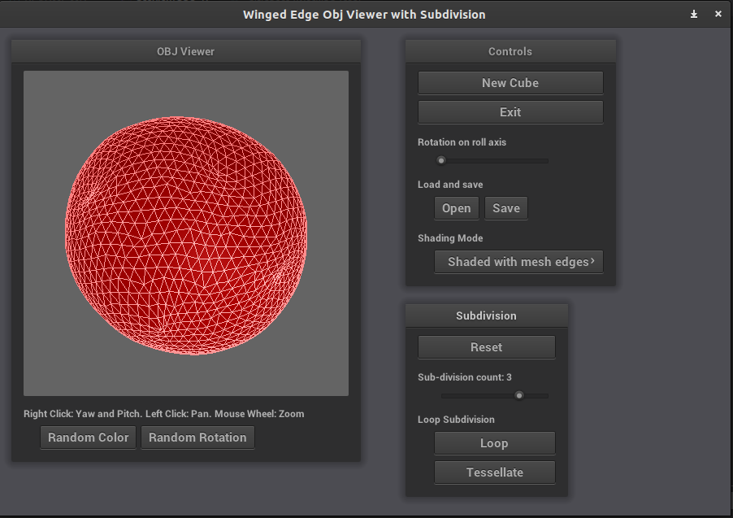

# OBJ View with Subdivision
The project was done for the Computer Graphics course. Loop sub-division is implemented using the Winged Edge data structure.


## How to compile and run the code?
1) Run `git submodule update --init --recursive`.
2) Compile and run the code as follows.
    ```bash
    mkdir build
    cd build
    cmake ../
    make
    ./subd
    ```
## Notes on Implementation of Subdivision
 1) To perform subdivision, choose level of subdivision using the Subdivision count slider and click "Loop".
 2) To perform only tessellation used by Loop Subdivision (no vertex or edge rule applied), select appropriate subdivision count from slider and click "Tessellate". Switch to wireframe view to view the tessellation. 
 3) Click "Reset" to reload the original mesh.
 4) Loop subdivision is implemented in `Subdivision/loopsubd.cpp` file. 
 
## Notes on implementation of OBJ View
 1) Whenever a mesh is loaded, it is automatically converted to a WingedEdge mesh. Upon saving, its converted back to an OBJ mesh.
 2) Rotation, zooming and translation was implemented using mouse controls and Model View Projection matrices.
 The model matrix is always identity. The view matrix changes as the user orbits / moves around an object. The projection matrix is an Orthogonal Projection, which changes its width and height based on zoom level.
 3) The camera is design to orbit around a target position, based on the rotation vector. The target position can be changed relative to the current view of camera by clicking and dragging the scene.
 4) In the example on Wireframe shading provided in assignment, back-sides are culled off. Thus, backsides are culled off in rendering.
 5) The WingedEdge structure is implemented in the directory [WingedEdge](include/WingedEdge). It uses classes Vertex, Edge and Face. The class WEMesh uses aforementioned classes to hold a mesh. It also implements following methods.
    - The method `ComputeSmoothShadingMatrices` of `WEMesh` is used to populate `position`, `normall` and `indices` matrices for smooth shading. Vertex normals are calculated as the average of adjacent face's normals.
    - The method `ComputeFlatShadingMatrices` of `WEMesh` is used to populate `position`, `normall` and `indices` matrices for flat shading. New vertices are introduces such that unique normals can be defined for triangle faces.
    - The method `populateExpandedVertexMatrix` of `WEMesh` is used to populate `expandedPositions` used to render wireframe on top of shaded mesh.
    - The method `loadModel` of `WEMesh` is used to develop a WingedEdge mesh using two matrices `positions` and `indices` retrieved from an obj file.
    - The method `fillOBJMesh` of `WEMesh` is used to fill a `OBJMesh` structure which can then be parsed as an OBJ file and save to disk.
 6) The OBJ parser is implemented by `WingedEdge/OBJMesh` class. It has methods `parseFile` and `saveFile` to load and save OBJ files.
 7) For rendering WireFrame on top of shaded mesh, the mesh is expanded by `0.01` or `maximum distance between two vertices divided by 100` units, whichever is smallest.
 8) Upon loading a new mesh, projection matrix is re-calculated to have left, bottom, top and right bounds be `maximum distance between two vertices divided by zoom`. Far plane is set to be `2 * maximum distance between two vertices + 400`.
